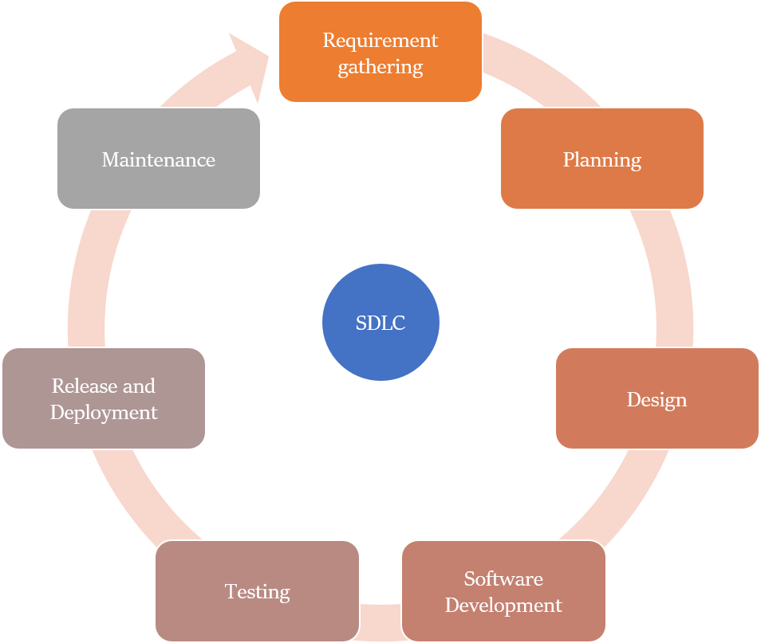

Have you ever wondered how a software is developed? You probably are curious about it if you are about to join an I.T. company or if you are a client who is looking for some tech agency to develop your website, app or some other software. If that’s the case then you have landed at the right spot. 

As a software engineer, let me assure you that the way this process is defined in text books does not prepare you adequately to face the reality of industry. 

This article will let you know all the basics involved in the process, as well as the things you need to keep in mind and some caveats. You should know about this whether you are a client or a developer; whether you are working in a product based I.T. company or a service based one. 

## What is Software Development Life Cycle (SDLC)?

In general terms Software Development Life Cycle (SDLC) is defined as a methodology with clearly defined steps that a development team needs to follow while developing a software. If executed properly, it allows development of quality software in least amount of time and cost. 

The phases that any software passes through are as follows:

* Requirement gathering and analysis phase
* Planning phase
* Design and Prototyping phase
* Software Development
* Testing
* Release and Deployment
* Evaluation and Maintenance

Moreover, keep in mind that these 7 phases are just a generalization. There are various SDLC models out there. Each such model combines and arranges these phases differently. You will have to find out what exact model your software team follows. 

Some of these SDLC models are : Waterfall Model, Iterative Model, Spiral Model, Big Bang Model, Agile Model etc. 

These SDLC models are more in the nature of guidelines. A software company may tweak any particular model while implementing it, so as to meet their specific requirements. 

Each of these models deserve a separate article of its own. Here, we will just focus on the various phases in the software development cycle that you will find in any SDLC model. 

## Various phases of SDLC models

### Requirement analysis Phase

In this phase the senior software engineers and managers (I.T.) meet with the clients and try to understand their requirements and problems. Thereafter they provide them an e-solution.This phase involves many rounds of meetings with the client. 

In case of a big service based I.T. company (e.g. Infosys, CSC, Wipro, TCS etc.), generally many Functional Specification documents (F.S.) are prepared and signed by both the parties. In functional specifications the details of the requirement are given e.g., the user interface of each page on a website or app, interlinking between pages, etc. In later phases these specifications are provided to the coders. 

In case of any future proposed changes on the part of the client, the course to be taken is laid down clearly. This all helps a lot in case of any future conflict. 

If a product based company (e.g. Adobe, Google etc.), this process is mostly done in-house, but even then inputs are taken from potential customers, industry experts and salesmen etc. 

### Planning Phase

After the requirements are clear, the software manager and architects estimate the cost, time and resources required for the project. Feasibility analysis is done and plans are drawn up to mitigate the possible risks. 

Some other decisions are also taken e.g., which programming language to use on the frontend and backend, database to be used, etc. 

### Design and Prototyping phase

In this phase the functional specifications are used to make design specifications. For example, a user interface designer will design the user interface (UI) or screen layout of each page, process diagrams, pseudocode etc. 

This serves two purposes:

* These designs may be presented to the client to get further clarity and resolve any grey areas. Feedback is taken from other stakeholders too.

* These designs help the coding team in the next phase. 

This phase is very crucial as this is kind of a last opportunity to modify the user requirements before coding is initiated. Most of the possible modifications must be tackled in this stage itself. Otherwise the cost of the project may shoot through the roof, as any change after coding phase is very costly and delays the project a lot. 

In most of the product based company you will also see the programmers making a minor watered down version of the proposed software. This is provided to the senior managers as proof of concept (PoC). 

As a client make sure that the design and coding team of the company you have given the project to, works in tandem. This is a very crucial step in the software development process. 

### Software development Phase

Now the coding is done keeping in mind all the guidelines and functional and design specifications agreed upon in the previous phases. The coders need to adhere to coding and documentation guidelines too. 

For example, if the coding language used is JavaScript then all the variables need to be in camelCase (e.g. nextCounter, minimumValue etc.). Writing proper comments inside the code is very important, especially for testing and maintenance purposes in the later stages. 

Technical writers develop a lot of documents, e.g. a document telling about the overall architecture of the project. It will be helpful if some new programmer joins in. Also, often companies have a separate testing team. They will need all this documentation in the testing phase.

### Testing Phase

No matter how good your technical team is, you will always have bugs in initial versions of the software, a lot of them. That’s why companies do extensive testing of the software before releasing the product or software module to the client/target users. 

Various test documents are created which lay down clearly the behaviour that is expected. When I joined my first software programming job, all that I did in the initial 6 months was testing a website that we were creating for a bank in Ireland.

Testing is done at various levels:

* Unit testing – testing separately each part of the code that is created.
* Integration testing
* System testing – The new code is uploaded on the server, where the old code is already live. Now, we see whether they run together fine without any issue. Often this is done in a staging environment, rather then on a live project. 
* Performance testing 

There are many other types of testing that are conducted. If a testing expert is also looking into the code, it’s called as ‘White box testing’. However, if he’s only looking at the user interface without looking at the code, it’s called ‘Black box testing’. 

### Release and Deployment

Now the software is released to the public or client. It may involve training the team at the client side on how to use the software and how to troubleshoot in case of some issue. 

### Evaluation and Maintenance

The software is evaluated and bugs reported and resolved even after it has been released. That is why many companies release a beta version first, before launching the final version. The beta version is used by the end users and their feedback is taken. 

Also, the requirements may change as the business demands change in the real world. The software needs to be updated accordingly and new versions released. 

As a client you must make sure that the extent of the developing team’s responsibility in the post-release phase is clearly mentioned in the agreement that you did with them. 

## Winding Up

We hope you now have a fair idea of what a Software Development Life Cycle (SDLC) looks like. As you can see, the major work in software development is not just coding. There are several peripheral tasks that are as important and even more so. 

If you are a software programmer or an I.T. manager, then you need to follow some SDLC model to reduce your cost and mitigate your risks. Just as you follow many other guidelines, e.g. Six Sigma to reduce bugs. It is the prime responsibility of software managers and business owners to gather clear user specifications and then make sure that the SDLC model is followed by the in-house team to a tee. 

If you are a client then do make sure what your software team is providing you in each stage. Also, you need to convey your requirements very clearly to the tech team. Remember, good communication is the foundation of a great final software product. 
